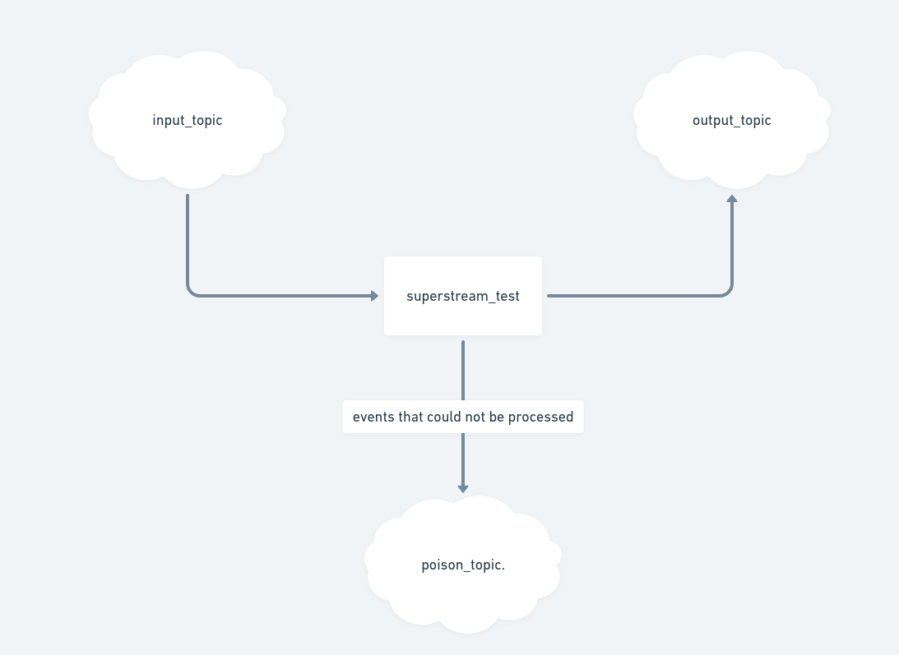

## Subtasks
1. Create core structure of the task implementation:
    1. Add proper Subscriber, Publisher, and Handler
    2. Write unit tests
    3. Make the app docker containerised
    4. Write instructions for running app
2. Make the project scalable    

## Tech stack
* [GO](https://go.dev/) as a main language
* [Viper](https://github.com/spf13/viper) for config management
* [fx](https://github.com/uber-go/fx) for dependency injection
* [Kafka] (https://kafka.apache.org/) as a event streaming platform
* [Kafdrop] (https://github.com/obsidiandynamics/kafdrop) web UI for Kafka
* [Watermil](https://watermill.io/pubsubs/kafka/) for working with message streams 
* [Docker] (https://www.docker.com/)
 
## Running locally
1. Start docker 
`docker-compose up`
2. Set configurations. Project contains `.env/dev` file to ease setup environment variables
`export $(cat .env/dev)`
3. Run service
`go run cmd/server/main.go`

## Architecture Diagram
